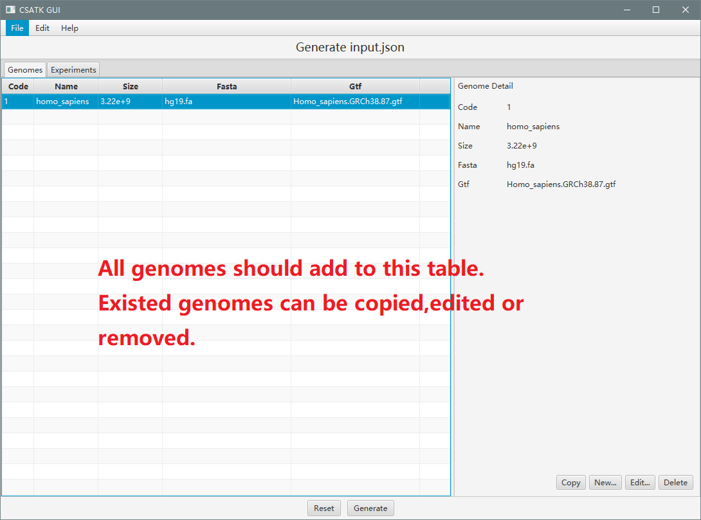
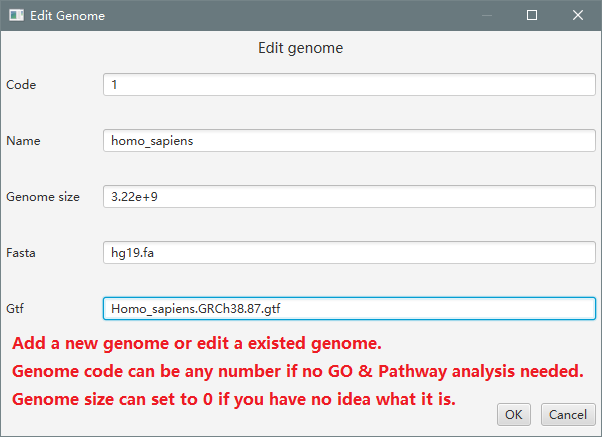
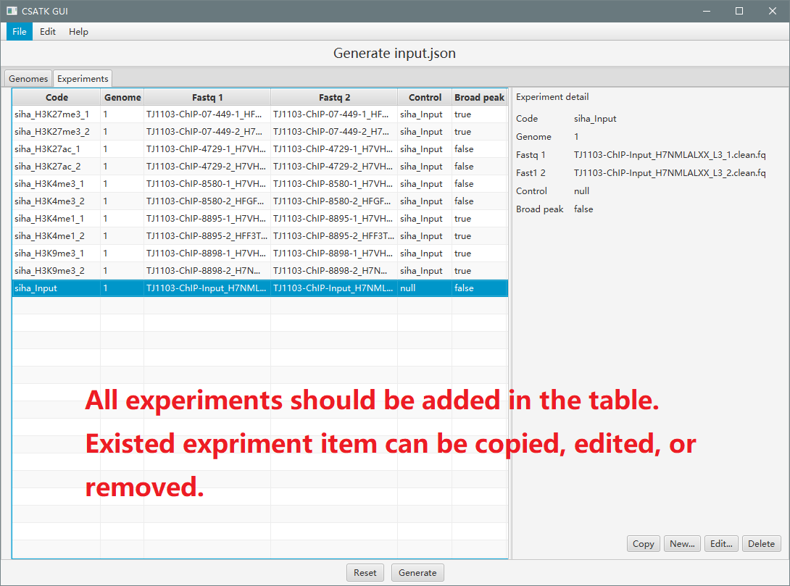
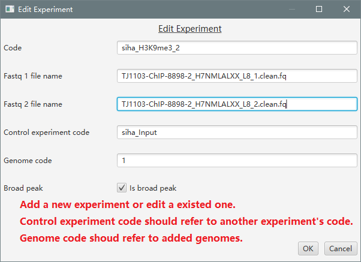
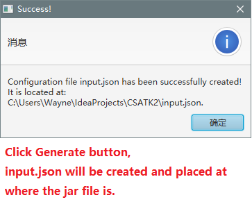

# CSATK (ChIP-Seq Analysis Toolkit)
## Introduction
CSATK is Java written bio-informatics software, the main goal of CSATK is to make ChIP-Seq analysis easier and more efficient.  

By integrating common used bio-informatics software and website such as FastQC, BWA, SAMTools, Qualimap, MACS2, Homer and Panther, CSATK can not only run a ChIP-Seq analysis pipeline, but also run single function or multiple functions in order.   

How to make it work? All you have to is create a **input.json** config file to tell CSATK your raw FASTQ data and relevant genome information.  

CSATK has following advantages:
1. High efficiency. Once the analysis starts, ChIP-Seq pipeline can automatically start next step without further command.  
2. Low error rate. Since all commands are generated by CSATK, there won't be any rookie mistake.  
3. Multiple functions. CSATK can do alignment, quality control, peak calling and so on,due to its integrating with the bio-informatics software mentioned above.  
4. Easy to use. CSATK has both command line support and GUI support for some functions.  

## Usage
### Tasks (run analysis pipeline, reset and backup data, print help, species, peak type information.):
#### CMD:	java -jar CSATK.jar <task>
	-h,	print help information and usage
	-p,	ChIP-Seq analysis pipeline
	-f,	run function(s) in order
	-s,	run solely function with arguments
	-i,	(re)install all software
	-r,	reset project to original state
	-b,	backup all file of last analysis
	-t,	print broad,narrow,mix peak type information
	-c,	print species code information

### Functions (run specific function or multiple functions in order):
#### CMD:	java -jar CSATK.jar -f <function1,function2,...>
	gi,	build genome index using bwa
	qr,	do quality control of raw reads using FastQC
	ar,	parse key information from raw reads' qc result
	tm,	filter adapter and bad quality reads using Trimmomatic
	qc,	do quality control of filtered reads using FastQC
	ac,	parse key information from filtered reads' qc result
	al,	align reads using bwa(BWA-MEM for > 70 bp, BWA-ALN for < 70bp)
	cs,	convert sam file to bam file using SAMTools
	sb,	sort converted bam files using SAMTools
	qb,	do quality control of sorted bam file using QualiMap
	rb,	remove PCR amplified reads from bam file using SAMTools
	ub,	filter reads those mapping quality >30 using SAMTools
	pc,	do peak calling using MACS2
	pa,	do peak annotation using Homer
	gl,	get annotated gene from annotation bed file
	gp,	do GO & Pathway analysis using PANTHERDB.org
	mt,	find motifs using Homer
	fs,	count reads in all bam files using SAMTools flagstat
	st,	do a statistics from output
	ht,	plot the statistic in HTML format

### Sole function (run function with the single CSATK.jar file, no other structure needed):
#### CMD:	java -jar CSATK.jar -s <function keyword> [arg1] [arg2] ...  
	1) GO & Pathway analysis:
		gp,	do GO & Pathway analysis using PANTHERDB.org [species code] [gene list] [output]

## Tutorial
### How to download and use CSATK
1. Download CSATK compressed file, [CSATK2-170503 release page](https://github.com/j1angvei/CSATK2/releases/tag/v2.0.170503);
2. Unzip the .tgz file, run `java -jar CSATK.jar -r` to restore CSATK structure;
3. Run `java -jar CSATK.jar -i` to install all relevant software(FastQC, BWA, SAMTools, etc.);
4. Place your raw data under **input** folder, genome reference file and annotation under **genome** folder;
5. Create your **input.json** file and put it under **config** folder (there is a template of input.json under the same folder);
6. Start the ChIP-Seq pipeline by running `java -jar CSATK.jar -p`.
### How to create your own **input.json** file

If you are familiar with [JSON](https://en.wikipedia.org/wiki/JSON) format, you can create it very easily using VIM (Linux) or Notepad (Windows). And all you need to is modify the input.json template in **config** folder.    

In case you have no idea what JSON format is or you just don't want to write the boilerplate, CSATK can help you create the input.json file, just double click the JAR file or run `java -jar CSATK.jar`.    

Under any environment with X Display support(Like Windows or Ubuntu Desktop) and [JRE](http://www.oracle.com/technetwork/java/javase/downloads/jre8-downloads-2133155.html),you can start CSATK GUI to help you create input.json.  

Here is a simple illustration of using CSATK GUI to create input.json:
1. Launch CSATK GUI by double clicking CSATK.jar or running `java -jar CSATK.jar` from console(Notice that only X display support devices can open CSATK GUI).  
2. Add all genome items in the table (you may need to remove the sample genome item).  
  
3. If you have many genome items which is very similar, you can copy it and then edit.  
  
4. Add all experiment items in the table (remember to remove the sample item).  
  
5. Edit the experiment item and check if something is wrong.  
  
6. Click _Generate_ button, a **input.json** will be created under the same location where you put the CSATK.jar.  
  

## About

## License